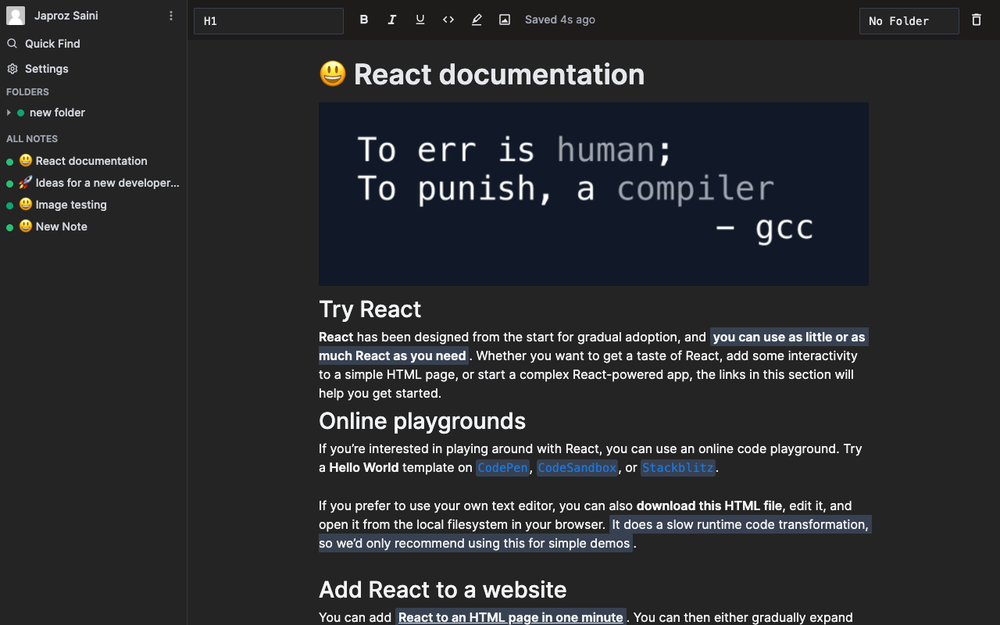

# Dino

Dino is a new website, mobile app and desktop app to jot down your thoughts and all the stuff that you want to access quickly and easily. Cos' not everything's about being productive. `Dino is a work in progress`

## Current status of dino

## Features

-   [x] A simple to use note taking experience
-   [x] Folders to organise notes in a concise, easy and well-understoof manner
-   [ ] A storage space like google cloud, dropbox so of around `5Gb` to access your files alongside your notes

## Contributing

ALl help is appreciated. If you want to contribute to `dino`, pls make a pull request and I'll review it.
